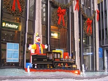
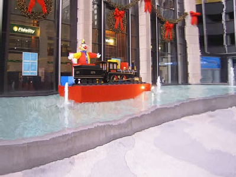
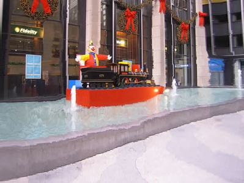
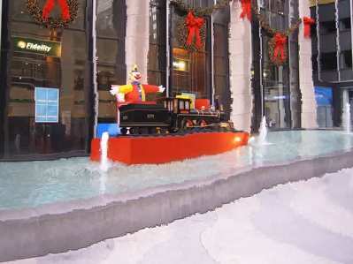
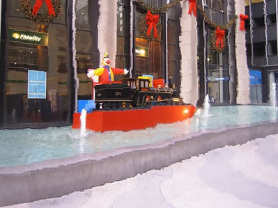
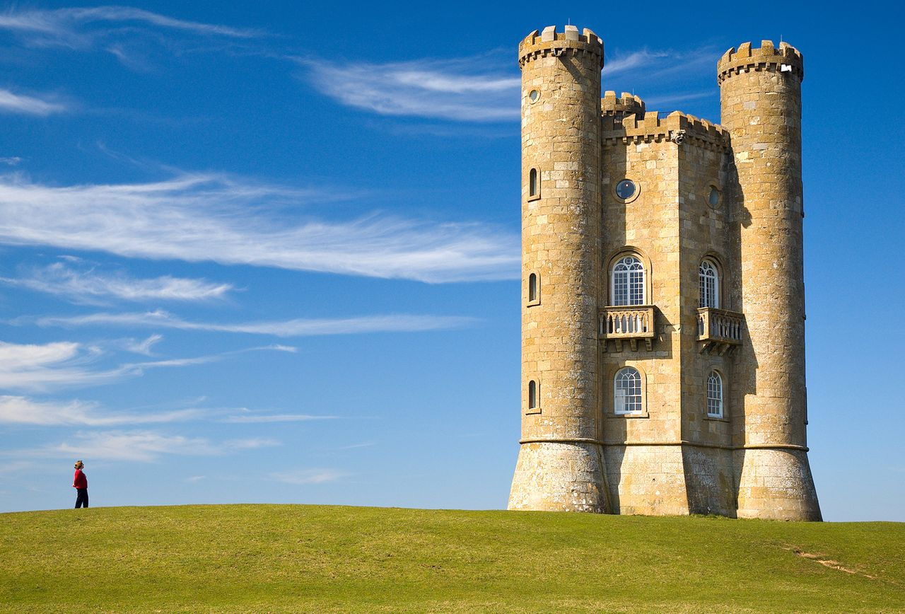
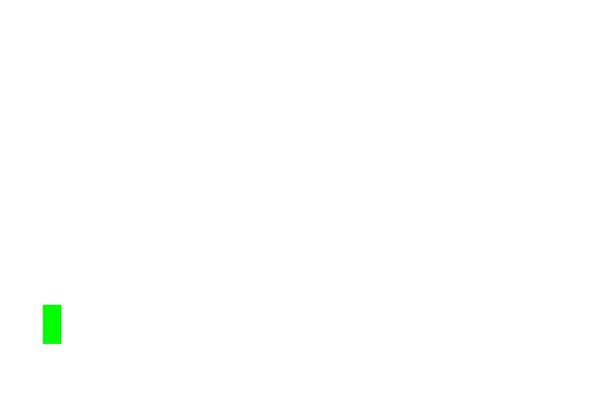
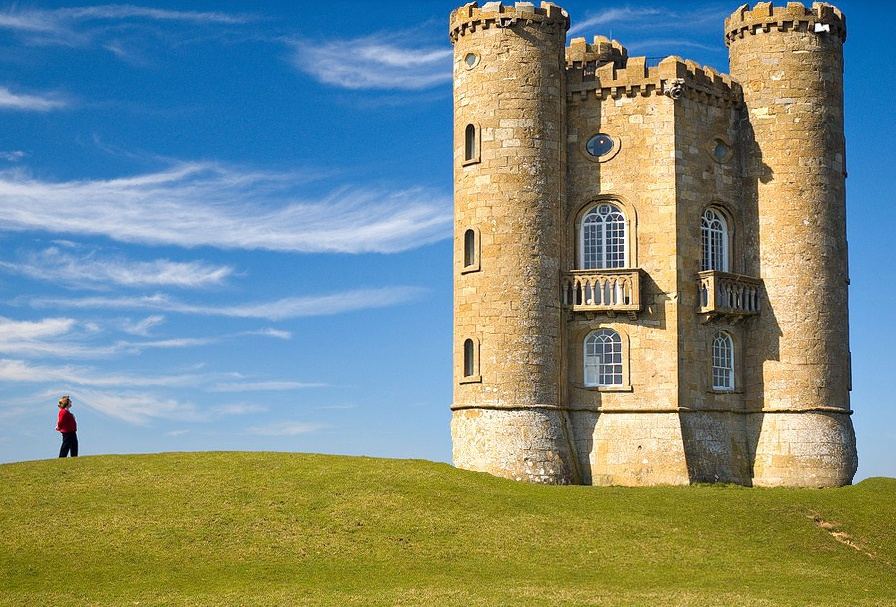
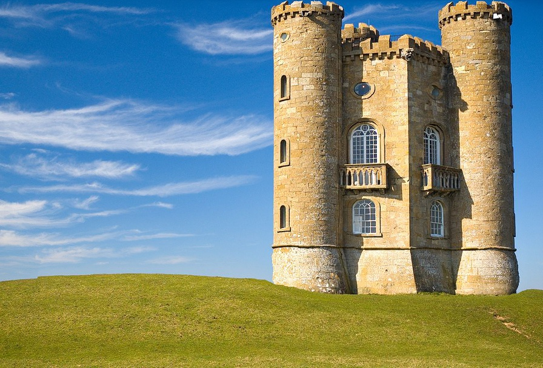

# 实验报告

计52 沈俊贤 2015011258

## 背景

论文：《Seam Carving for Content-Aware Image Resizing》

本人实现代码github仓库：https://github.com/datawine/seam_carving

作为一种高效的改变图片大小的算法，Seam Carving通过定义一种全新的图片剪裁方法，达到对图片中重要部分进行保留，对图片中不重要部分删除的效果的算法。

## 算法原理

### Seam的定义

论文中提到了一个核心的概念：细缝。通过对单条细缝的增加和删除，来达到对整体图片的放缩。其中，一条竖直细缝的定义如下：

$s^x=\{s_i^x\}_{i=1}^n=\{(x(i),i)\}_{i=1}^n \quad s.t. \forall i,|x(i)-x(i-1)|\leq 1, \ x:[1,...,n]\to[1,...,m]​$

用通俗的语言来说，就是一条八联通的从上到下的“细缝”。

同理一条垂直细缝的定义如下：

$s^y=\{s_j^y\}_{j=1}^m=\{(j,y(j))\}_{j=1}^m \quad s.t. \forall j,|y(j)-y(j-1)|\leq 1, \ y:[1,...,m]\to[1,...,n]$

在算法中，在每一次迭代的过程里，需要找到能量最小的一条细缝，并进行增加或删除的操作。

### 能量的定义

一条细缝的能量，就是细缝的所有像素的能量的加和。即：

$E(s)=\sum_{i=1}^ne(I(s_i))$

而对于像素的能量，则取决于不同的能量函数的选择，作者在论文中提到了以下几种能量函数：

- $e_1$函数：即像素的一阶偏导数
- 像素的二阶偏导数
- Itti显著性区域检测
- Harris角点检测
- 信息熵
- HoG(Histogram of Gradient)
- 脸部识别

### 具体应用

#### 图片放缩

对于图片缩小来说，只需要每次选择能量最小的一条细缝进行删除即可。而图片放大则要一次性找出若干条细缝，同时放大，这样就能够得到比较平滑的结果。

#### 增删细缝的顺序

对于一张同时需要在行和列上进行放缩的图片，如何选择行列增加删除的顺序？这实际上是一个优化问题：优化的目的在于选择某一特定的行列增加删除顺序，使得能量的变化最小。

#### mask

可以通过对图片加mask的方式，达到人为对某些区域进行特定调节的目的。

如缩小图片时，选择删除某些特定的区域，则可以通过mask的方式，让mask区域的能量人为设定为一个非常小的值，这样在删除的过程中就会优先删除添加了mask的区域。

如放大图片时，选择保留某些特定的区域，则可以通过mask的方式，让mask区域的能量人为设定为一个非常大的值，这样在添加的过程中就会忽略添加了mask的区域。

#### 多尺寸图像

因为各个设备上所需要的图片的大小不一样，而算法的速度又没有办法做到实时计算，所以可以利用算法的动态规划特性，在算法的不同阶段保存下中间结果：即每条细缝的参数，就可以达到自适应多尺度图像的条件了。

## 实现细节及结果

### 项目代码解释

- calc_energy.py
  - 计算能量函数
- pySaliencyMap.py和pySalientcyMapDefs.py
  - 引用他人外部图像显著性区域检测库
- seam_carving.py
  - 包含SeamCarving类，完成三种功能：对任意图像的缩小、对任意图像的放大、对任意图像能够删除特定区域的缩小

### 实现的考虑

对于论文实验的重点在于以下几个方面：

- 算法的正确性
- 对于性质不同的能量函数的比较
- 对于放大和缩小图像的实现
- 对于mask相关功能的实现

忽略实现了论文中重复度高的工作：

- 性质类似的能量函数：如显著性区域和人脸识别
- 性质类似的功能：如实现了放大和缩小、带mask的缩小，于是忽略带mask的放大
- 耗时但实现简单的功能：如多尺寸图片和行列增删顺序的优化

### 能量函数的比较

所有源图片保存在`./images/`文件夹下，所有结果图片保存在`./res/算子名称/`文件夹下，放缩比例均为`0.3`，即放大后的图片长、宽为原来的`1.3`倍，缩小后的图片长、宽为原来的`0.7`。

示例图片：

以下是图片长、宽分别变为源图片`0.7`倍的效果。从上到下分别为：经过灰度转换和平滑的L1梯度算子，rgb三通道分别计算并加和的L1算子，rgb三通道分别计算并加和的L2算子，拉普拉斯算子，显著性区域检测算子

以下是图片长、宽分别变为源图片`1.3`倍的效果。从上到下分别为：经过灰度转换和平滑的L1梯度算子，rgb三通道分别计算并加和的L1算子，rgb三通道分别计算并加和的L2算子，拉普拉斯算子，显著性区域检测算子

从以上对比可以对几种算子有比较清楚的认识：

- L1算子，无论是灰度层面上还是rgb三个通道加和层面上，都能够比较好的保持原来的线条的形状，不至于弯曲变形
- 拉普拉斯算子和L2，能够对横纵梯度比较大大和比较小的地方做到比较好的形状保存（如斜线或图片中红色底座），但是对线条的形状保存不好，容易弯曲变形
- 显著性区域算子，对相应的显著性区域有比较好的保存效果

### 对增删细缝顺序的思考

增删细缝的顺序，实际上也可以通过类似的动态规划完成，但是不同于对于seam的搜索，这里的每一次搜索的时间都是巨大的。所以不太容易能够在短时间内调试出来，而增加的时间是多项式级别的，这明显得不偿失。

### 对添加mask进行区域选择后的效果展示

对以下图片进行mask的添加，目标为删除mask覆盖位置的原图片像素，即删除图中人物。

原图片：

mask：

没有mask操作的直接缩小`0.7`倍：

有mask操作的缩小`0.7`倍：

可以看到，准确而删除了拥有掩码的人像部分。

## 优缺点及改进方向

### 优点

seam carving作为一个content-aware的算法，在一般情况下，对于图片的放缩有比较好的效果，尤其是在拥有大片背景的图片中，能够起到非常好的效果。

### 缺点

seam carving的缺点也十分明显，主要为以下几点：

#### 放大图片时产生的问题

在放大图片时，放大的大小不能超过原图片的两倍，否则必然会出现明显的条状区域。这时由算法本身所决定的。

#### 算法的时间复杂度

算法的时间复杂度过高，虽然在单步中能够通过动态规划来优化算法， 但是每次仍然不可避免需要重新计算细缝和能量等数值。

#### 对噪声背景的识别较难

如上图中的草地背景，因为能量函数的定义，导致一般来说会将草地作为”显著区域“而非”背景“。

#### 改进空间小

算法的改进空间较小，能够展现出更好的效果，应该只能从时间和能量函数两个方面入手。

## 实验感想

seam carving作为一种非常经典的图片放缩算法，其核心思想也是非常易懂的。但是在更加细节的层面，比如加速算法的完成、能量函数的选择、对行列顺序的优化等，就需要更多的考虑。

